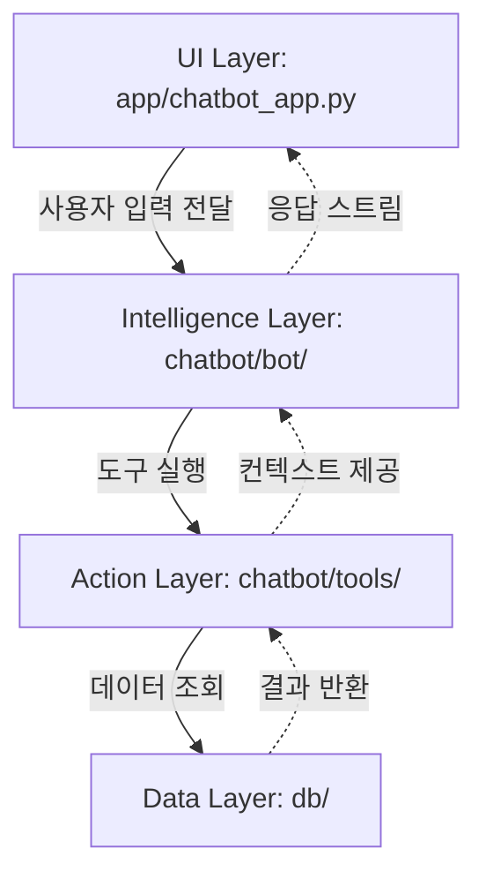
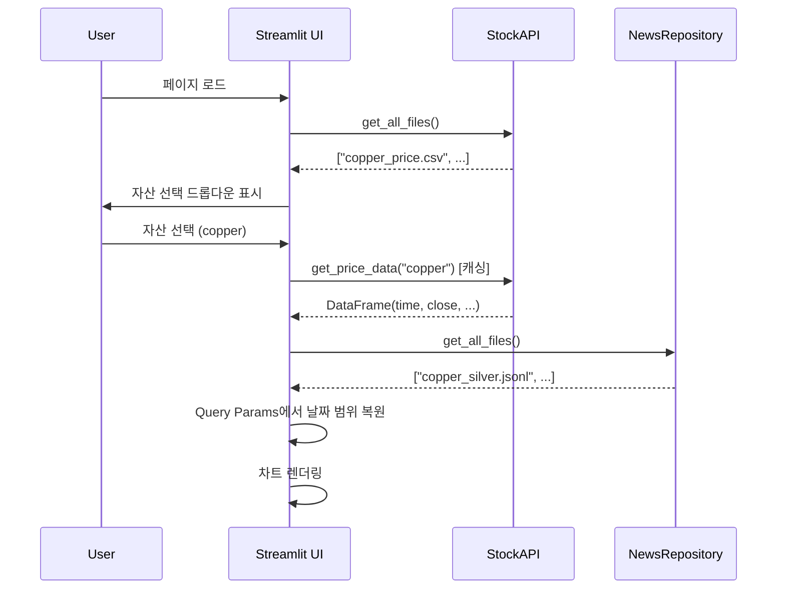
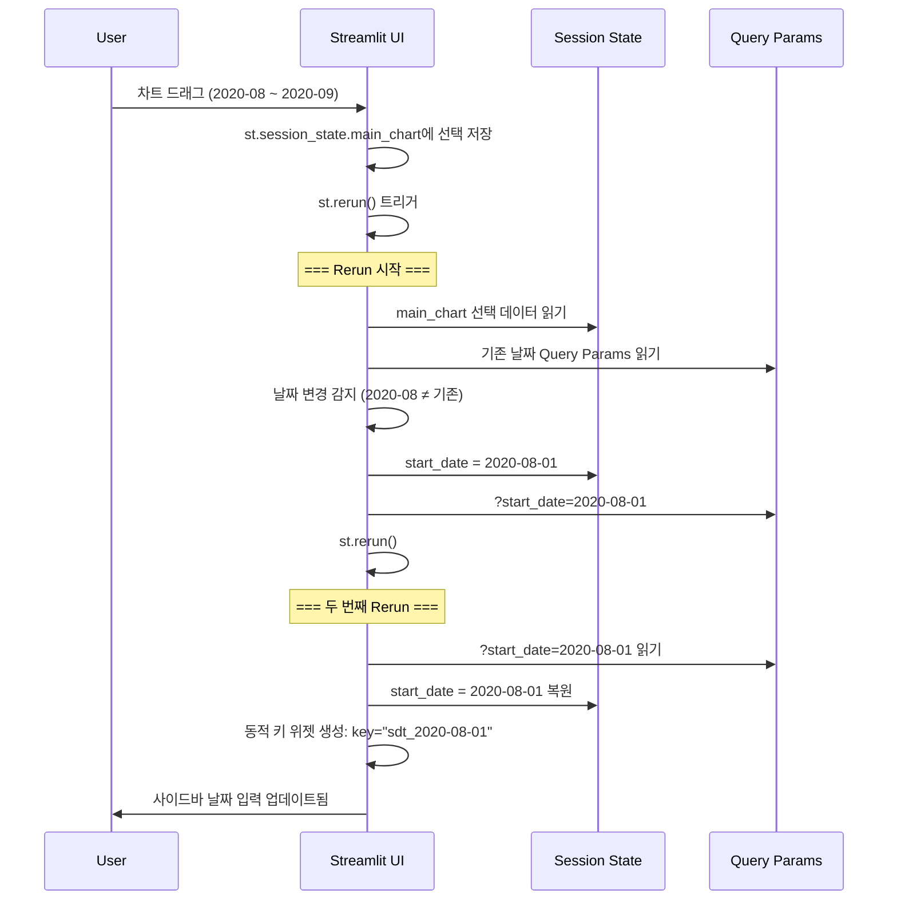
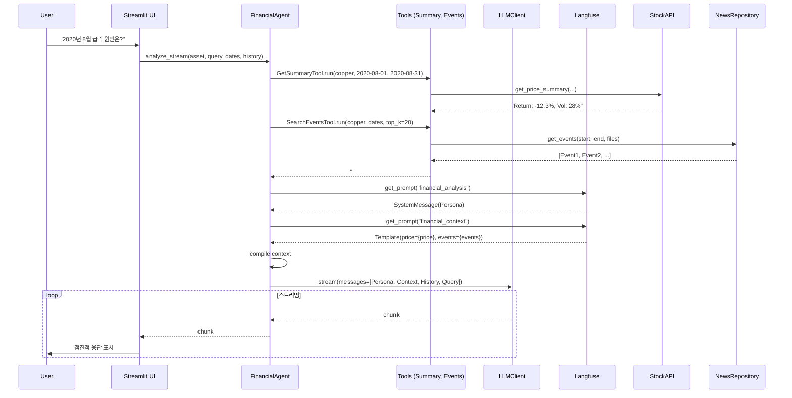

# Project Architecture Documentation

## 프로젝트 개요

**주식 시장 뉴스 기반 사건 추출 및 심층 분석 챗봇** - 2017~2025년 뉴스 데이터를 기반으로 "사건" 중심의 맥락을 제공하고, RAG(검색 증강 생성)를 통해 근거 있는 금융 정보를 답변하는 시스템

## 1. 디렉토리 구조

```
/Users/yejoon/Documents/ai tech/tilda_data/
├── app/                          # UI Layer
│   └── chatbot_app.py           # Streamlit 메인 애플리케이션
├── chatbot/                      # Intelligence & Action Layer
│   ├── bot/                     # 챗봇 핵심 로직
│   │   ├── agent.py            # FinancialAgent (에이전트 오케스트레이션)
│   │   ├── llm_client.py       # LLMClient (LLM 호출 추상화)
│   │   └── prompt.py           # PromptManager (Langfuse 프롬프트 관리)
│   └── tools/                   # 에이전트 도구
│       ├── get_summary.py      # GetSummaryTool (가격 통계 요약)
│       └── search_events.py    # SearchEventsTool (고변동성 이벤트 검색)
├── db/                          # Data Layer
│   ├── stock_api.py            # StockAPI (주가 데이터 조회)
│   ├── news_repo.py            # NewsRepository (뉴스/사건 조회)
│   └── vector_store.py         # VectorStore (벡터 검색 - Placeholder)
├── config/                      # Configuration
│   ├── chatbot.yaml            # 챗봇 비즈니스 설정
│   └── llm/                    # LLM 제공자별 설정
│       ├── gemini.yaml
│       ├── local.yaml
│       └── openai.yaml
└── data/                        # Data Files
    ├── prices/                 # 주가 CSV 파일
    ├── events/                 # 사건 JSON/JSONL 파일
    └── articles/               # 기사 CSV 파일
```

---

## 2. 계층 아키텍처 (Layered Architecture)

### 2.1 계층 정의



### 2.2 계층별 책임

| 계층 | 디렉토리 | 책임 | 의존성 |
|-----|---------|------|-------|
| **UI Layer** | `/app` | 사용자 인터페이스, 상태 관리, 시각화 | Intelligence Layer |
| **Intelligence Layer** | `/chatbot/bot` | LLM 호출, 프롬프트 관리, 에이전트 흐름 제어 | Action Layer |
| **Action Layer** | `/chatbot/tools` | 특화된 기능 제공 (요약, 검색 등) | Data Layer |
| **Data Layer** | `/db` | 데이터 조회 및 캐싱 | 파일 시스템 |

---

## 3. 주요 클래스 및 함수

### 3.1 UI Layer: `app/chatbot_app.py`

**역할**: Streamlit 기반 웹 인터페이스

**주요 기능**:
- 자산 선택 및 데이터 로딩
- 날짜 범위 관리 (Query Params 기반 상태 관리)
- 동적 차트 렌더링 (Plotly)
- 이벤트 타임라인 표시
- AI 챗봇 인터페이스

**핵심 로직**:
```python
# 차트 선택 처리 (Pre-rendering)
if "main_chart" in st.session_state:
    # 날짜 범위를 Query Params에 저장하여 rerun 간 유지

# 사이드바 초기화
with st.sidebar:
    # Query Params에서 날짜 복원 (단일 진실 공급원)
    q_start = st.query_params.get("start_date")
    # 동적 위젯 키로 날짜 입력 생성
    st.date_input("Start Date", key=f"sdt_{st.session_state.start_date}")

# 메인 차트
fig = go.Figure(...)
st.plotly_chart(fig, on_select="rerun", selection_mode="box")

# 챗봇 인터페이스
agent = FinancialAgent(cfg)
for chunk in agent.analyze_stream(...):
    st.write(chunk.content)
```

**상태 관리 전략**:
- **Query Params**: 날짜 범위의 단일 진실 공급원 (URL 기반 영속성)
- **Session State**: 런타임 상태 (자산명, 이벤트 파일 선택)
- **동적 위젯 키**: `key=f"sdt_{date}"` 패턴으로 날짜 변경 시 위젯 재생성

---

### 3.2 Intelligence Layer

#### 3.2.1 `FinancialAgent` (chatbot/bot/agent.py)

**역할**: 에이전트 오케스트레이션 - 사용자 쿼리를 처리하고 LLM 응답 생성

**속성**:
- `cfg`: Hydra 설정 객체
- `client`: LLM 클라이언트
- `prompt_manager`: 프롬프트 관리자
- `stock_api`, `news_repo`: 데이터 소스
- `summary_tool`, `events_tool`: 도구 인스턴스

**주요 메서드**:

```python
def analyze_stream(self, asset_name, user_query, start_date, end_date, 
                   chat_history, target_files=None):
    """
    스트리밍 방식으로 LLM 응답 생성
    
    흐름:
    1. 도구를 사용하여 컨텍스트 생성 (가격 요약 + 이벤트 필터링)
    2. Langfuse에서 프롬프트 가져오기
    3. 메시지 구성 (Persona + Data Context + Chat History + User Query)
    4. LLM 스트림 반환
    """
```

**메시지 구조**:
```
[SystemMessage(Persona)] 
-> [SystemMessage(Data Context)]  
-> [Chat History...]  
-> [HumanMessage(User Query)]
```

---

#### 3.2.2 `LLMClient` (chatbot/bot/llm_client.py)

**역할**: LLM 제공자 추상화 (OpenAI, Gemini, Local 지원)

**초기화 로직**:
```python
def __init__(self, llm_cfg):
    provider = llm_cfg.provider  # gemini / local / openai
    cfg = llm_cfg[provider]
    api_key = os.environ.get(cfg.secret_key_name)
    
    if provider == "gemini":
        self.model = ChatGoogleGenerativeAI(...)
    else:
        self.model = ChatOpenAI(...)
```

**주요 메서드**:
- `get_response(messages, callbacks)`: 일반 응답
- `get_stream(messages, callbacks)`: 스트리밍 응답

---

#### 3.2.3 `PromptManager` (chatbot/bot/prompt.py)

**역할**: Langfuse 기반 프롬프트 버저닝 관리

**주요 메서드**:
```python
def get_persona_prompt(self):
    """금융 분석가 페르소나 프롬프트"""
    return self.langfuse.get_prompt(self.cfg.prompts.financial_analysis)

def get_context_prompt(self):
    """데이터 컨텍스트 템플릿"""
    return self.langfuse.get_prompt(self.cfg.prompts.financial_context)
```

**프롬프트 관리 철학**: Human-Driven Development - 개발자가 Langfuse Web UI에서 직접 프롬프트 개발 및 버저닝

---

### 3.3 Action Layer: Tools

#### 3.3.1 `GetSummaryTool` (chatbot/tools/get_summary.py)

**역할**: 기간 내 가격 통계 요약

```python
def run(self, asset_name: str, start_date: date, end_date: date) -> str:
    """
    반환 예시:
    ### Market Statistics: COPPER
    - Period: 2020-01-01 ~ 2020-12-31
    - Return: 15.23% (5000 -> 5761)
    - Volatility (Ann.): 22.45%
    """
    return self.stock_api.get_price_summary(asset_name, start_date, end_date)
```

---

#### 3.3.2 `SearchEventsTool` (chatbot/tools/search_events.py)

**역할**: 고변동성 날짜 기반 이벤트 필터링

```python
def run(self, asset_name, start_date, end_date, target_files=None, top_k=20):
    """
    로직:
    1. 주가 데이터에서 변동성 계산 (|일간 수익률|)
    2. 상위 volatile 날짜 추출
    3. 해당 날짜의 뉴스 이벤트만 필터링
    4. Markdown 형식으로 반환 (날짜, 가격, 제목, 설명)
    """
```

---

### 3.4 Data Layer

#### 3.4.1 `StockAPI` (db/stock_api.py)

**역할**: 주가 데이터 조회 및 통계 계산

**캐싱**: `@st.cache_data(ttl=3600)` - 1시간 동안 메모리 캐시

**주요 메서드**:
```python
def get_all_files(self) -> list[str]:
    """사용 가능한 주가 파일 목록 반환"""

@st.cache_data(ttl=3600)
def get_price_data(_self, asset_name: str) -> pd.DataFrame:
    """CSV 파일에서 주가 데이터 로드 (캐싱됨)"""

def get_price_summary(self, asset_name, start_date, end_date) -> str:
    """기간 수익률, 변동성 등 통계 계산"""
```

---

#### 3.4.2 `NewsRepository` (db/news_repo.py)

**역할**: 뉴스 이벤트 및 기사 데이터 조회

**캐싱**: `@st.cache_data(ttl=3600)` - 기사 데이터 로딩 캐싱

**주요 메서드**:
```python
def get_all_files(self) -> List[str]:
    """이벤트 파일 목록 (.json/.jsonl)"""

@st.cache_data(ttl=3600)
def _load_articles(_article_dir, target_files=None) -> Dict[str, Dict]:
    """기사 CSV 로드 및 ID 기반 lookup 딕셔너리 생성 (Static 캐싱)"""

def get_events(self, start_date, end_date, keywords=None, target_files=None):
    """
    이벤트 로딩 및 필터링:
    1. 기사 메타데이터 로드 (_load_articles)
    2. JSON/JSONL 파싱
    3. 날짜 범위 필터링
    4. 키워드 필터링 (선택)
    5. 기사 메타데이터 enrichment (source ID 기반 조인)
    """
```

**데이터 Enrichment**:
```python
# Event의 'source' 필드 (기사 ID 리스트)를 사용하여
# article_map에서 메타데이터(제목, URL, 설명)를 가져와 'articles' 필드에 추가
item['articles'] = [article_map[sid] for sid in source_ids if sid in article_map]
```

---

#### 3.4.3 `VectorStore` (db/vector_store.py)

**역할**: 벡터 기반 의미 검색 (현재 Placeholder)

```python
def search_similar_events(self, query: str, top_k: int = 3) -> List[Dict]:
    """Qdrant/Chroma 연동 예정 - 현재는 Mock 데이터 반환"""
```

---

## 4. 데이터 흐름 (Data Flow)

### 4.1 페이지 로드 흐름



### 4.2 차트 드래그 & 날짜 동기화



**핵심 메커니즘**: 
- Query Params = 단일 진실 공급원 (URL 영속성)
- 동적 위젯 키 = 날짜 변경 시 Streamlit이 새 위젯으로 인식

### 4.3 챗봇 메시지 처리



---

## 5. 설정 관리 (Configuration)

### 5.1 Hydra 구조

```yaml
# config/chatbot.yaml
data:
  dir_path: ./data/prices
  event_result_path: ./data/events
  
llm:
  provider: gemini  # gemini / local / openai
  
prompts:
  financial_analysis: financial_analyst_v1
  financial_context: market_data_context_v1
```

```yaml
# config/llm/gemini.yaml
gemini:
  model: gemini-2.0-flash-exp
  secret_key_name: GOOGLE_API_KEY
  temperature: 0.3
```

### 5.2 환경 변수 (.env)

```bash
GOOGLE_API_KEY=...
OPENAI_API_KEY=...
LANGFUSE_PUBLIC_KEY=...
LANGFUSE_SECRET_KEY=...
```

---

## 6. 성능 최적화

### 6.1 캐싱 전략

| 대상 | 메서드 | 캐시 방식 | TTL | 효과 |
|-----|--------|----------|-----|------|
| 주가 데이터 | `StockAPI.get_price_data` | `@st.cache_data` | 1시간 | CSV 재로딩 방지 |
| 기사 메타데이터 | `NewsRepository._load_articles` | `@st.cache_data` | 1시간 | CSV 파싱 방지 |

**캐싱 주의사항**:
- 인스턴스 메서드: 첫 파라미터를 `_self`로 명명하여 캐시 키에서 제외
- Static 메서드: `@st.cache_data` 직접 적용

### 6.2 상태 관리 최적화

**Query Params 우선 전략**:
```python
# BAD: Session State만 사용 (rerun 시 손실)
st.session_state.start_date = new_date

# GOOD: Query Params + Session State
st.query_params["start_date"] = str(new_date)
st.session_state.start_date = new_date
```

---

## 7. 확장 가능성

### 7.1 계층별 확장 포인트

| 계층 | 확장 영역 | 구현 방법 |
|-----|----------|----------|
| **UI** | FastAPI 서빙 | `/api` 폴더에 REST API 구현, 챗봇 모듈 재사용 |
| **Intelligence** | 새 LLM 제공자 | `LLMClient.__init__`에 provider 분기 추가 |
| **Action** | 새 도구 | `chatbot/tools/` 에 새 클래스 추가, Agent에 바인딩 |
| **Data** | 실제 DB 연동 | `/db` 내부 구현만 교체 (인터페이스 유지) |

### 7.2 Vector Store 구현 예정

```python
# db/vector_store.py (Future)
from qdrant_client import QdrantClient

class VectorStore:
    def __init__(self, collection_name):
        self.client = QdrantClient(...)
        
    def search_similar_events(self, query: str, top_k: int = 3):
        embedding = get_embedding(query)
        results = self.client.search(
            collection_name=self.collection,
            query_vector=embedding,
            limit=top_k
        )
        return [hit.payload for hit in results]
```

---

## 8. 핵심 설계 원칙

### 8.1 계층 독립성
- **상위 → 하위 의존**: UI는 Agent를 알지만, Agent는 UI를 모름
- **의존성 주입**: Agent는 StockAPI, NewsRepository를 생성자에서 주입받음

### 8.2 단일 책임 원칙
- **LLMClient**: LLM 호출만 담당
- **PromptManager**: 프롬프트 관리만 담당
- **Tools**: 특정 기능에만 집중

### 8.3 설정 중앙화
- Hydra로 모든 설정 관리
- 환경 변수로 민감 정보 분리
- Langfuse로 프롬프트 버저닝

---

## 9. 주요 디자인 패턴

### 9.1 Repository 패턴
- `StockAPI`, `NewsRepository`: 데이터 소스 추상화
- 향후 DB/API 교체 시 인터페이스 유지

### 9.2 Strategy 패턴
- `LLMClient`: provider에 따라 다른 구현체 선택

### 9.3 Facade 패턴
- `FinancialAgent`: 복잡한 도구 실행 및 LLM 호출을 단순 인터페이스로 제공

---

## 10. 코딩 규칙

### 10.1 Type Hinting
```python
def get_events(
    self, 
    start_date: date, 
    end_date: date, 
    keywords: Optional[List[str]] = None
) -> List[Dict]:
```

### 10.2 Docstrings (Google Style)
```python
def run(self, asset_name: str, start_date: date, end_date: date) -> str:
    """
    Tool function to get market statistical summary.
    
    Args:
        asset_name: Asset identifier (e.g., "copper")
        start_date: Analysis period start
        end_date: Analysis period end
        
    Returns:
        Markdown-formatted price summary
    """
```

### 10.3 1 File 1 Function (Tools)
- `chatbot/tools/get_summary.py`: GetSummaryTool만 정의
- `chatbot/tools/search_events.py`: SearchEventsTool만 정의
