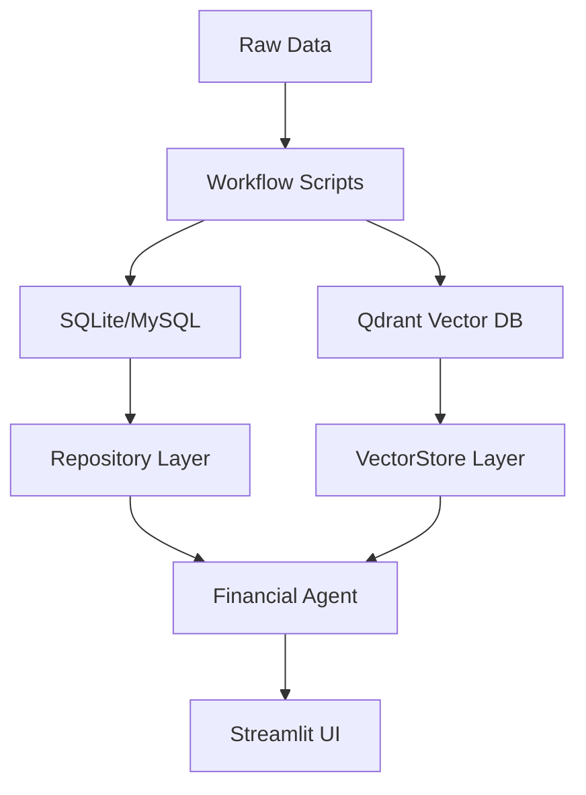

# Project Architecture Documentation

## 프로젝트 개요

**주식 시장 뉴스 기반 사건 추출 및 심층 분석 챗봇** - 2017~2025년 뉴스 데이터를 기반으로 "사건" 중심의 맥락을 제공하고, RAG(검색 증강 생성) 및 하이브리드 검색을 통해 근거 있는 금융 정보를 답변하는 시스템입니다.

## 1. 디렉토리 구조

```
/Users/yejoon/Documents/ai tech/tilda_data/
├── app/                          # UI Layer (Streamlit)
│   └── chatbot_app.py           # 메인 대시보드 및 챗봇 인터페이스
├── chatbot/                      # Intelligence Layer
│   ├── bot/                     # 핵심 에이전트 로직 (Agent, LLMClient, Prompt)
│   └── tools/                   # Action Layer (LLM이 사용하는 도구들)
├── db/                          # Data Access Layer (RDB)
│   ├── database.py             # SQLAlchemy 모델 (MySQL/SQLite 호환)
│   ├── price_repo.py           # 가격 데이터 및 자산 목록 관리 (Metadata Caching)
│   ├── event_repo.py           # 사건 데이터 및 연관 기사 조인 (Optimized)
│   └── article_repo.py         # 기사 상세 내용 관리 (Metadata Caching)
├── vector_db/                    # Vector DB Layer
│   ├── vector_store.py         # Qdrant Hybrid Search (Shared Model Loading)
│   └── resource_manager.py     # RAG 리소스 및 컬렉션 관리 (Config Driven)
├── preprocess/                   # Implementation Logic
│   ├── embed_and_upsert.py     # 벡터 인덱싱 로직
│   ├── sqlite_ingestor.py      # Bulk RDB Ingestion (Optimized)
│   └── chunk_financial_documents.py # 문서 분할 및 가공
├── workflow/                     # CLI Orchestration
├── config/                      # Hydra 기반 모듈형 설정 (App, Infra, LLM)
├── data/                        # 원천 데이터 (CSV, JSONL) 및 청크
└── sqlite/                      # Local SQLite Database 폴더
```

---

## 2. 데이터베이스 계층 (MySQL & SQLite)

운영 데이터베이스는 다음 테이블 구조를 따르며, SQLAlchemy를 통해 매핑됩니다. 개발 환경에서는 SQLite를, 실서비스 환경에서는 MySQL을 사용하도록 유연하게 전환 가능합니다.

| 테이블명 | 모델명 | 설명 |
|---------|-------|------|
| `commodity` | `Asset` | 자산 종류 (옥수수, 금, 구리 등) |
| `futures_price` | `Price` | 일자별 종가 및 거래량 (commodity_id 외래키) |
| `event` | `Event` | 기사 기반 추출 사건 (start_date, title, source_article_ids) |
| `article` | `Article` | 원천 뉴스 기사 (ID, 제목, 내용, 발행일) |

---

## 3. 핵심 아키텍처 원칙

### 3.1 계층 독립성 및 추상화 (Layered Abstraction)
- **UI Layer**는 데이터의 물리적 저장소 종류를 인지하지 않으며, `Repository` 인터페이스를 통해 일관된 방식으로 데이터를 요청합니다.
- **Config Driven**: 모든 경로나 DB 연결 정보는 코드에 하드코딩되지 않고 Hydra 설정을 통해 주입됩니다.

### 3.2 퍼포먼스 최적화 (Performance Optimization)
- **Metadata Caching**: `st.cache_data`를 활용하여 자산 목록 및 기사 메타데이터 조회 성능을 수천 배 향상시켰습니다.
- **Shared Model Loading**: 벡터 검색을 위한 임베딩 모델(PIXIE)을 클래스 레벨에서 캐싱하여 메모리 점유와 초기 로딩 속도를 최적화했습니다.
- **Bulk Ingestion**: 수십만 건의 데이터를 처리할 때 `bulk_insert_mappings`와 메모리 기반 키 검사를 통해 데이터베이스 부하를 최소화했습니다.

### 3.3 하이브리드 검색 (Hybrid Search)
Qdrant를 사용하여 두 가지 모델을 결합한 검색을 지원합니다:
- **Dense Vector**: `PIXIE-Rune` 모델을 사용하여 시맨틱 의미 검색 수행.
- **Sparse Vector**: `PIXIE-Splade` 모델을 사용하여 키워드 일치성 보강.

---

## 4. 데이터 플로우



---

## 5. 설정 및 환경 관리

- **Hydra Configuration**: `config/infra/data.yaml`에서 모든 경로를 관리하며, `resolve_path` 유틸리티를 통해 프로젝트 루트 기준의 상대 경로를 절대 경로로 변환하여 사용합니다.
- **Environment Isolation**: `.gitignore`를 통해 `data/`, `sqlite/`, `.env` 등을 격리하여 코드와 데이터를 분리합니다.
